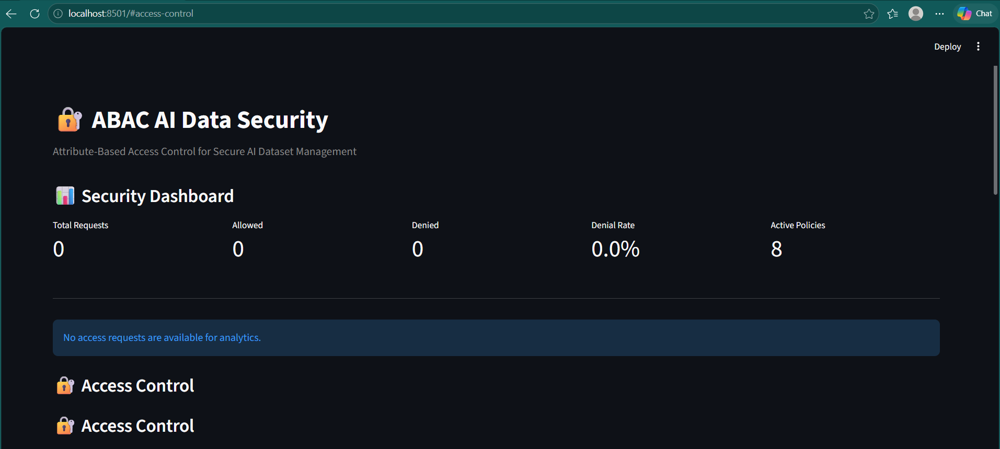
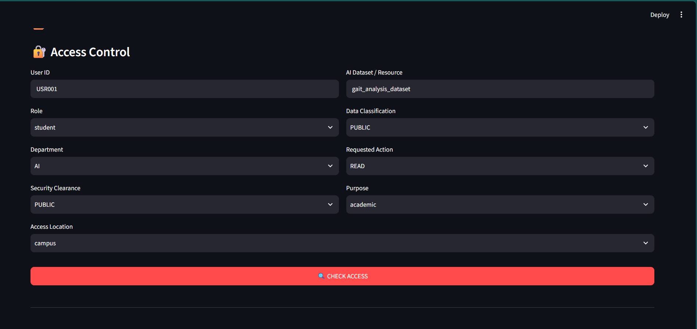
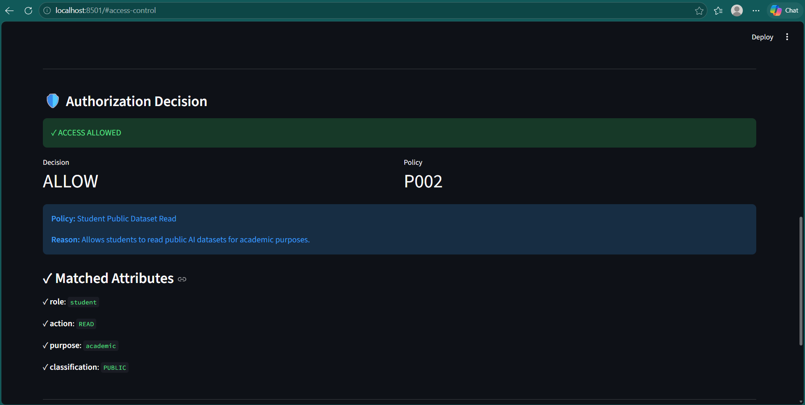
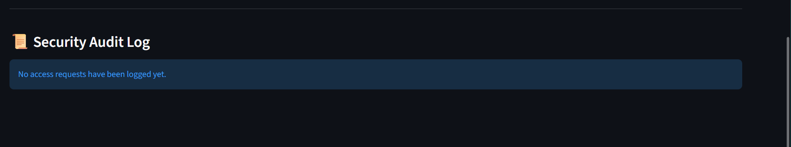

# 🔐 Attribute-Based Access Control for AI Data

A policy-driven **Attribute-Based Access Control (ABAC)** system for securing AI datasets and resources based on user attributes, resource classification, action, purpose, and contextual information.

The project provides an explainable authorization engine, policy management, security analytics dashboard, and SQLite-based audit logging through a Streamlit web application.

---

## 📌 Project Overview

Traditional access-control systems often rely heavily on predefined user roles. In AI and data-driven environments, access decisions may need to consider multiple attributes simultaneously, such as:

* User role
* Department
* Security clearance
* Resource classification
* Requested action
* Purpose of access
* Location

This project implements an **Attribute-Based Access Control (ABAC)** approach where access requests are evaluated against configurable JSON policies.

The system produces an **ALLOW** or **DENY** decision and provides an explanation showing which policy was applied and why.

---

## 🎯 Objectives

* Implement attribute-based access control for AI data.
* Enforce policy-driven authorization decisions.
* Support explicit `ALLOW` and `DENY` policies.
* Implement policy priority.
* Apply default-deny security behavior.
* Provide explainable access-control decisions.
* Maintain an audit trail of access attempts.
* Provide security analytics through a Streamlit dashboard.
* Automate authorization testing using Pytest.

---
## ⭐ Project Highlights

- 🔐 Attribute-Based Access Control for AI datasets
- ⚖️ Priority-based policy evaluation
- 🚫 Explicit ALLOW and DENY policies
- 🛡️ Default-deny security model
- 🔎 Explainable authorization decisions
- 📋 SQLite-based audit logging
- 📊 Streamlit security analytics dashboard
- 📜 JSON-based configurable policies
- 🧩 Dedicated policy management module
- 🧪 Automated authorization testing with Pytest
- 🐍 Python-based implementation

## ✨ Key Features

### 🔐 Attribute-Based Authorization

Access decisions are based on combinations of attributes rather than role alone.

Example:

```text
Role           = researcher
Department     = AI
Action         = READ
Purpose        = research
Classification = CONFIDENTIAL
```

All required attributes must satisfy the applicable policy conditions.

### 🚫 Explicit DENY Policies

The system supports policies that explicitly deny access.

For example:

```text
Student + Confidential Dataset + READ
                    ↓
                 DENY
```

### ⚖️ Policy Priority

Policies contain a priority value.

Higher-priority policies are evaluated first, allowing security-critical DENY policies to take precedence over lower-priority rules.

### 🛡️ Default DENY

If no policy matches an access request:

```text
No matching policy
       ↓
     DENY
```

This follows a fail-secure authorization model.

### 🔎 Explainable Decisions

The system reports:

* Matching policy
* Policy description
* Policy priority
* Matched attributes
* Failed attributes
* Expected attribute values
* Received attribute values

This makes authorization decisions easier to understand and audit.

### 📋 Audit Logging

Every access request evaluated through the application can be recorded in SQLite with information including:

* Request ID
* User ID
* Role
* Department
* Resource
* Classification
* Action
* Purpose
* Decision
* Policy ID
* Policy name
* Reason
* Timestamp

### 📊 Security Analytics Dashboard

The Streamlit dashboard provides security monitoring information such as:

* Total requests
* Allowed requests
* Denied requests
* Denial rate
* Active policies
* Access decisions
* Access attempts by role
* Access by action
* Most accessed resources
* Policy usage

---

## 🏗️ System Architecture

```text
┌──────────────────────────────┐
│          User                │
│      Access Request          │
└──────────────┬───────────────┘
               │
               ▼
┌──────────────────────────────┐
│      Streamlit Dashboard     │
│        app.py                │
└──────────────┬───────────────┘
               │
               ▼
┌──────────────────────────────┐
│       Policy Manager         │
│     policy_manager.py        │
└──────────────┬───────────────┘
               │
               ▼
┌──────────────────────────────┐
│        ABAC Engine           │
│       abac_engine.py         │
│                              │
│ • Attribute Matching         │
│ • Policy Priority            │
│ • Explicit DENY              │
│ • Default DENY               │
│ • Explainable Decisions      │
└──────────────┬───────────────┘
               │
               ▼
       ┌───────────────┐
       │ ALLOW / DENY  │
       └───────┬───────┘
               │
               ▼
┌──────────────────────────────┐
│      Audit Logger            │
│     audit_logger.py          │
└──────────────┬───────────────┘
               │
               ▼
┌──────────────────────────────┐
│          SQLite              │
│      Access Audit Logs       │
└──────────────────────────────┘
```

---

## 🔄 Authorization Workflow

```text
Access Request
      │
      ▼
Extract Attributes
      │
      ▼
Load ABAC Policies
      │
      ▼
Sort by Priority
      │
      ▼
Evaluate Conditions
      │
      ├───────────────┐
      │               │
      ▼               ▼
 Policy Match?      No Match
      │               │
   Yes│               │
      ▼               ▼
ALLOW / DENY       Default DENY
      │
      ▼
Explain Decision
      │
      ▼
Create Audit Log
```

---

## 📜 Policy Model

Policies are stored in:

```text
policies/policies.json
```

Example:

```json
{
  "policy_id": "P001",
  "name": "Researcher AI Dataset Read",
  "effect": "ALLOW",
  "priority": 50,
  "conditions": {
    "role": ["researcher"],
    "department": ["AI"],
    "action": ["READ"],
    "purpose": ["research"],
    "classification": ["CONFIDENTIAL"]
  }
}
```

---

## 📊 Current Policy Configuration

The project currently contains:

| Policy Type    |   Count |
| -------------- | ------: |
| Total Policies |   **8** |
| ALLOW Policies |   **6** |
| DENY Policies  |   **2** |
| Policy Version | **2.0** |

### Configured Policies

| Policy ID | Effect | Purpose                                   |
| --------- | ------ | ----------------------------------------- |
| P100      | DENY   | Block student access to confidential data |
| P090      | DENY   | Block remote restricted-data access       |
| P001      | ALLOW  | Researcher confidential dataset READ      |
| P002      | ALLOW  | Student public dataset READ               |
| P003      | ALLOW  | Admin restricted dataset access           |
| P004      | ALLOW  | Data scientist internal dataset access    |
| P005      | ALLOW  | Security team audit access                |
| P006      | ALLOW  | Researcher internal dataset WRITE         |

---

## 🧪 Test Results

Automated authorization tests are implemented using **Pytest**.

Current test suite:

```text
6 passed
```

Test cases include:

| Test                           | Expected Result |
| ------------------------------ | --------------- |
| Researcher confidential READ   | ALLOW           |
| Student confidential access    | DENY            |
| Unknown/unsupported access     | DENY            |
| Student public dataset READ    | ALLOW           |
| Data scientist internal access | ALLOW           |
| Researcher internal WRITE      | ALLOW           |

Run the tests with:

```bash
pytest -v
```

---

## 🖥️ Example Access Decisions

The synthetic access-request dataset contains eight test scenarios.

| Request | Action | Decision | Policy       |
| ------- | ------ | -------- | ------------ |
| REQ001  | READ   | ALLOW    | P001         |
| REQ002  | READ   | ALLOW    | P002         |
| REQ003  | READ   | DENY     | P100         |
| REQ004  | READ   | ALLOW    | P003         |
| REQ005  | READ   | ALLOW    | P004         |
| REQ006  | WRITE  | ALLOW    | P006         |
| REQ007  | DELETE | DENY     | Default DENY |
| REQ008  | READ   | ALLOW    | P005         |

This demonstrates both explicit policy-based denial and default-deny behavior.

---

## 🗂️ Project Structure

```text
ABAC-AI-Data-Security/
│
├── app.py
├── abac_engine.py
├── database.py
├── audit_logger.py
├── policy_manager.py
│
├── policies/
│   └── policies.json
│
├── data/
│   └── access_requests.json
│
├── database/
│   └── .gitkeep
│
├── tests/
│   └── test_abac.py
│
├── screenshots/
│   └── .gitkeep
│
├── requirements.txt
├── .gitignore
└── README.md
```

The SQLite database is generated locally and excluded from version control.

---

## 🛠️ Technologies Used

### Programming

* Python

### Application

* Streamlit

### Data Processing

* Pandas

### Database

* SQLite

### Configuration

* JSON

### Testing

* Pytest

### Development Tools

* VS Code
* Git
* GitHub

---

## ⚙️ Installation

### 1. Clone the repository

```bash
git clone <YOUR-GITHUB-REPOSITORY-URL>
cd ABAC-AI-Data-Security
```

### 2. Create a virtual environment

Windows:

```powershell
python -m venv venv
```

Activate it:

```powershell
.\venv\Scripts\activate
```

### 3. Install dependencies

```powershell
pip install -r requirements.txt
```

---

## ▶️ Running the Application

Start the Streamlit dashboard:

```powershell
streamlit run app.py
```

Open:

```text
http://localhost:8501
```

---

## 🧪 Running the ABAC Engine Directly

The policy engine can also be executed from the terminal:

```powershell
python abac_engine.py
```

This evaluates the synthetic access requests and displays the authorization decisions.

---

## 📋 Running the Policy Manager

```powershell
python policy_manager.py
```

Example output:

```text
============================================================
             ABAC POLICY MANAGER
============================================================
Policy Version : 2.0
Total Policies : 8
ALLOW Policies : 6
DENY Policies  : 2
============================================================
```

---

## 🔍 Security Design

The system follows several important security principles:

### Least Privilege

Access is granted only when the request satisfies the required policy conditions.

### Default Deny

Requests without a matching authorization policy are denied.

### Policy-Based Control

Authorization logic is separated from application code through configurable JSON policies.

### Explicit Denial

High-priority security policies can explicitly block access.

### Auditability

Access decisions are recorded for security monitoring and investigation.

### Explainability

The engine provides information about why a request was allowed or denied.

---
## 📸 Application Screenshots

### 1. Security Dashboard

The Streamlit dashboard provides an overview of the ABAC security system, including total access requests, allowed requests, denied requests, denial rate, and active policies.



---

### 2. Access Control Interface

The access-control interface allows an access request to be submitted using multiple attributes, including user role, department, security clearance, dataset classification, requested action, purpose, and access location.



---

### 3. Authorization Decision

The authorization result provides an explainable access-control decision. The screenshot demonstrates an **ALLOW** decision under policy `P002`, along with the matched attributes and policy explanation.



---

### 4. Security Audit Log

The application includes a dedicated Security Audit Log section for displaying access attempts and their authorization results. The screenshot shows the audit-log interface in its clean initial state before access requests are recorded.


## 🚀 Future Enhancements

Potential future improvements include:

* Role hierarchy support
* More advanced attribute operators
* Time-based access policies
* IP/network-based policies
* Multi-factor authentication integration
* Policy administration interface
* PostgreSQL-based centralized audit logging
* REST API for authorization requests
* Docker deployment
* Role and attribute management
* Policy versioning
* Advanced anomaly detection for suspicious access patterns
* Integration with AI/ML data platforms

---

## ⚠️ Disclaimer

This project is an academic security prototype designed to demonstrate Attribute-Based Access Control concepts.

It should not be considered a production-ready enterprise authorization system without additional security hardening, authentication, secure policy administration, database protection, monitoring, and deployment controls.

---

## 👨‍💻 Author

**Devaraja Katti**

B.E. Artificial Intelligence & Machine Learning
Dayananda Sagar College of Engineering

---


